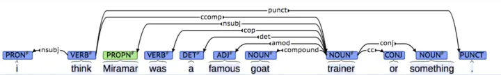

# 2020-09-14

开始学习CS224N，之前看了一部分，但是已经忘记看到哪里了，索性重新看一遍，并且记一些笔记
b站：https://www.bilibili.com/video/BV18Y411p79k?p=1&vd_source=5dfb70630ca8dca05b6a4596cf8fc9dc
cs224n: https://web.stanford.edu/class/archive/cs/cs224n/cs224n.1214/index.html

# lecture1: Introduction and word vectors

PPT: https://web.stanford.edu/class/archive/cs/cs224n/cs224n.1214/slides/cs224n-2021-lecture01-wordvecs1.pdf

1. WordNet
   WordNet: A Lexical Database for English：大型的英文词汇数据库、同义词集合。
   https://zhuanlan.zhihu.com/p/366370332
   缺点：

- 消歧问题
- 不能计算词之间的相似性：fantastic and great，不是同义词，但是都表示类似的含义
- 静态的词典，动态增加的成本很高

2. 分布式表示、连续的词向量

- 传统的机器学习：把单词看成离散的one-hot编码，不能很好地表示词与词之间的关系和相似性
  VS
- 现在的深度学习把词表示成连续的特征向量，用于表示词之间的相似性。

如何表示单词的向量：分布式语义 distributional semantics：由周围的单词表示。贯穿统计学和深度学习。
单词的向量 word vector：在相似的上下文中出现的单词之间的相似性高。

3. word2vec

https://zhuanlan.zhihu.com/p/114538417
https://zhuanlan.zhihu.com/p/26306795

Skip-gram: 中心词预测上下文
CBOW：上下文预测中心词
隐藏层没有激活函数
一般使用输入向量
Hierarchical Softmax： 待学
Negative Sampling： 待学
问题：

- 一个词有多种含义时，依然用同一个词向量表示

# lecture2：Neural Claassifiers

https://web.stanford.edu/class/archive/cs/cs224n/cs224n.1214/slides/cs224n-2021-lecture02-wordvecs2.pdf

1. word2vec

- 优点:
  - 能表示词之间的相似性
  - 能表示词之间的相加相减性
- 缺点：
  - 不能区分context和center的远近

1.1 negative sampling

将交叉熵损失函数变成二元分类函数，判断词对是不是属于相邻词，减少计算量
paper: Distributed Representations of Words and Phrases and their
Compositionality
$J = -\log(\sigma(u_o^T*v_c)) - \sum_{k=取样的k个负样本}{\log(\sigma(u_k^T*v_c))}$

1.2 word2vec vs 共现矩阵+SVD分解

count_based:

- 用于计算单词相似性
- 对经常出现的词给了不恰当的重要性

word2vec:

- 能用于下游任务
- 除了相似性，还能捕捉到其他模式特征

1.3 word2vec vs glove

glove 公式推导由来
https://zhuanlan.zhihu.com/p/58389508
虽然觉得其中有些地方的说服力不是很强，但是也能说通
44：51

6. 如何评估词向量

固有的：

- 在具体的子任务上
- 快

外在的：

- 真实任务
- 慢

# Lecture3: Backprop

https://web.stanford.edu/class/archive/cs/cs224n/cs224n.1214/slides/cs224n-2021-lecture03-neuralnets.pdf

# Lecture4: Dependency Parsing

https://web.stanford.edu/class/archive/cs/cs224n/cs224n.1214/slides/cs224n-2021-lecture04-dep-parsing.pdf

20：55

dependency parsing : 句法结构解析

对于 **句法结构(syntactic structure)** 分析，主要有两种方式：Constituency Parsing与Dependency Parsing。

---

**Constituency Parsing**

固定的语法规则 （可以简单理解成正则表达式） -- 上下文无关语法

先分析每个单词的词性，然后根据语法规则，从小到大，不断组合成短语

---

Dependency Parsing

一句话中单词之间的依存关系

参考资料：

https://zhuanlan.zhihu.com/p/66268929

https://blog.csdn.net/qq_27586341/article/details/110001823
