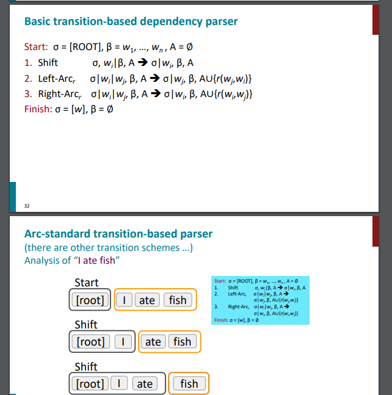
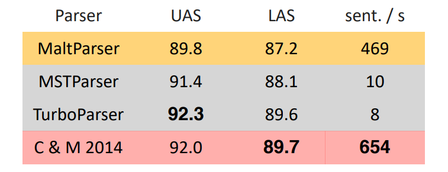
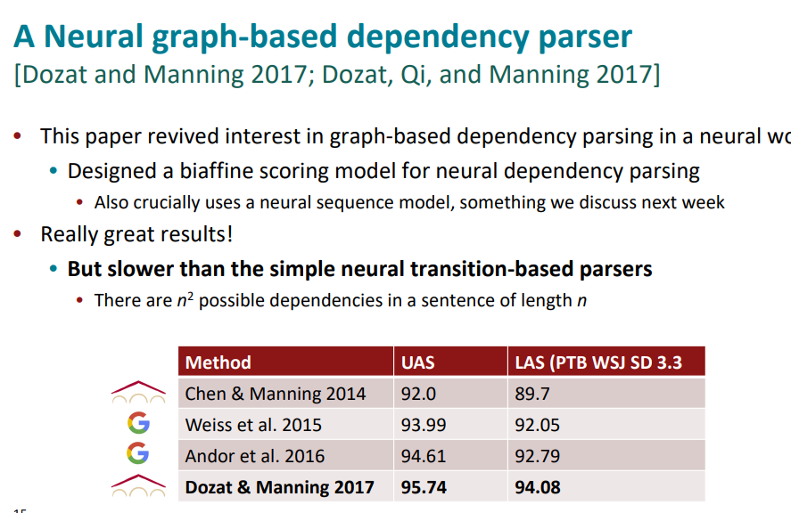
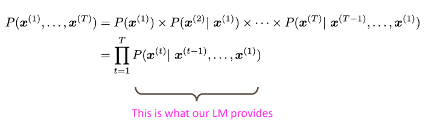
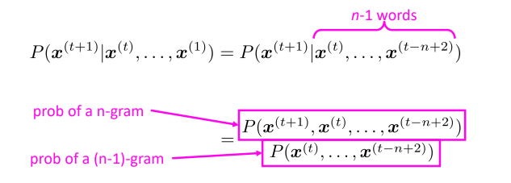
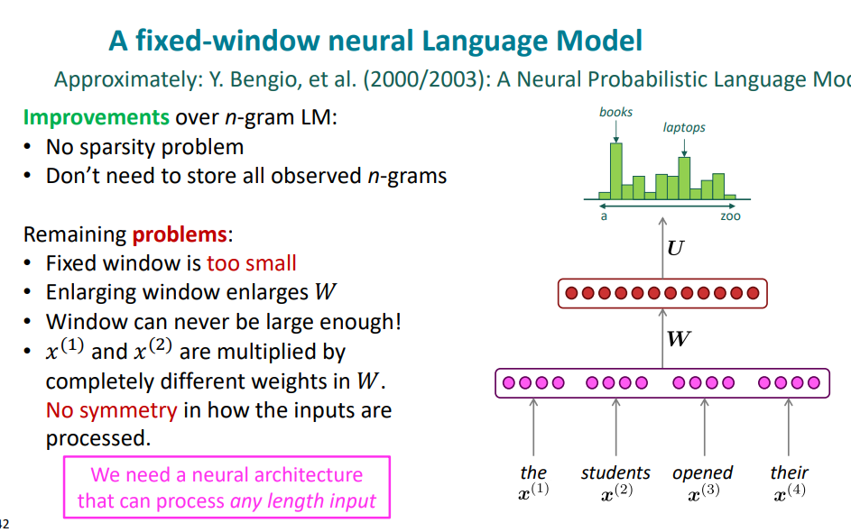
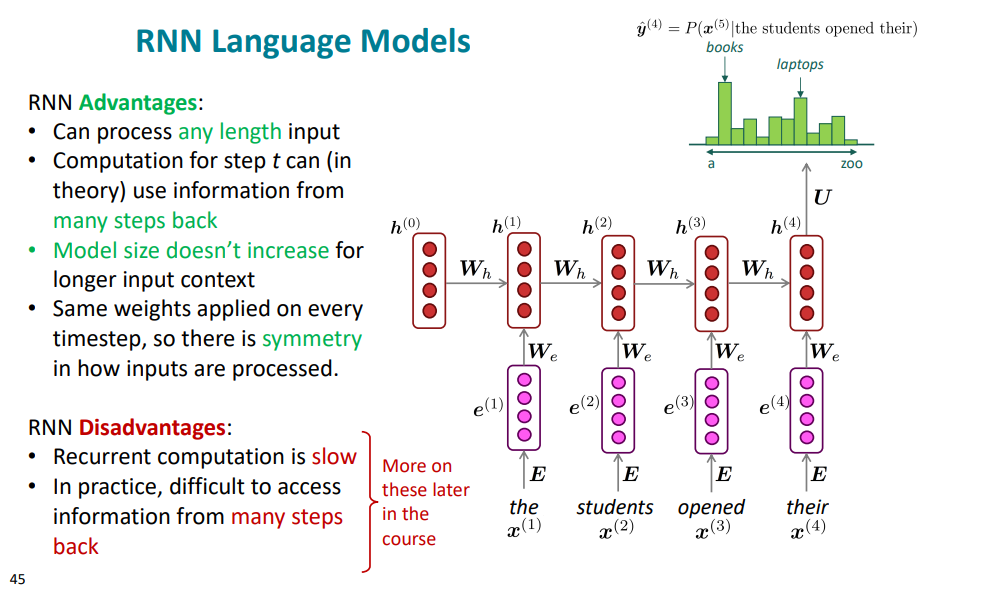
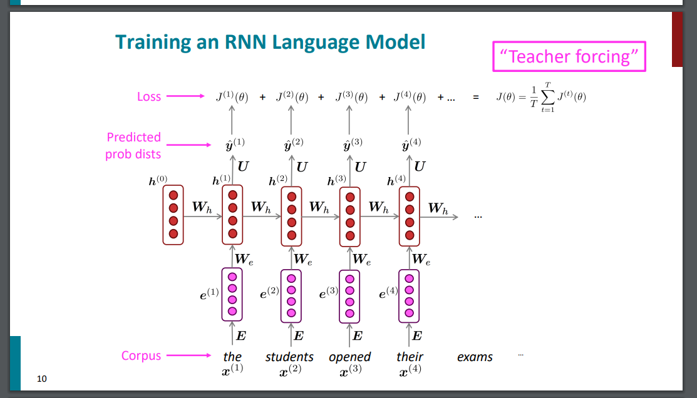

# 2020-09-14

开始学习CS224N，之前看了一部分，但是已经忘记看到哪里了，索性重新看一遍，并且记一些笔记
b站：https://www.bilibili.com/video/BV18Y411p79k?p=1&vd_source=5dfb70630ca8dca05b6a4596cf8fc9dc
cs224n: https://web.stanford.edu/class/archive/cs/cs224n/cs224n.1214/index.html

# lecture1: Introduction and word vectors

PPT: https://web.stanford.edu/class/archive/cs/cs224n/cs224n.1214/slides/cs224n-2021-lecture01-wordvecs1.pdf

1. WordNet
   WordNet: A Lexical Database for English：大型的英文词汇数据库、同义词集合。
   https://zhuanlan.zhihu.com/p/366370332
   缺点：

- 消歧问题
- 不能计算词之间的相似性：fantastic and great，不是同义词，但是都表示类似的含义
- 静态的词典，动态增加的成本很高

2. 分布式表示、连续的词向量

- 传统的机器学习：把单词看成离散的one-hot编码，不能很好地表示词与词之间的关系和相似性
  VS
- 现在的深度学习把词表示成连续的特征向量，用于表示词之间的相似性。

如何表示单词的向量：分布式语义 distributional semantics：由周围的单词表示。贯穿统计学和深度学习。
单词的向量 word vector：在相似的上下文中出现的单词之间的相似性高。

3. word2vec

https://zhuanlan.zhihu.com/p/114538417
https://zhuanlan.zhihu.com/p/26306795

Skip-gram: 中心词预测上下文
CBOW：上下文预测中心词
隐藏层没有激活函数
一般使用输入向量
Hierarchical Softmax： 待学
Negative Sampling： 待学
问题：

- 一个词有多种含义时，依然用同一个词向量表示

# lecture2：Neural Claassifiers

https://web.stanford.edu/class/archive/cs/cs224n/cs224n.1214/slides/cs224n-2021-lecture02-wordvecs2.pdf

1. word2vec

- 优点:
  - 能表示词之间的相似性
  - 能表示词之间的相加相减性
- 缺点：
  - 不能区分context和center的远近

1.1 negative sampling

将交叉熵损失函数变成二元分类函数，判断词对是不是属于相邻词，减少计算量
paper: Distributed Representations of Words and Phrases and their
Compositionality
$J = -\log(\sigma(u_o^T*v_c)) - \sum_{k=取样的k个负样本}{\log(\sigma(u_k^T*v_c))}$

1.2 word2vec vs 共现矩阵+SVD分解

count_based:

- 用于计算单词相似性
- 对经常出现的词给了不恰当的重要性

word2vec:

- 能用于下游任务
- 除了相似性，还能捕捉到其他模式特征

1.3 word2vec vs glove

glove 公式推导由来
https://zhuanlan.zhihu.com/p/58389508
虽然觉得其中有些地方的说服力不是很强，但是也能说通
44：51

6. 如何评估词向量

固有的：

- 在具体的子任务上
- 快

外在的：

- 真实任务
- 慢

# Lecture3: Backprop

https://web.stanford.edu/class/archive/cs/cs224n/cs224n.1214/slides/cs224n-2021-lecture03-neuralnets.pdf

# Lecture4: Dependency Parsing

https://web.stanford.edu/class/archive/cs/cs224n/cs224n.1214/slides/cs224n-2021-lecture04-dep-parsing.pdf

20：55

dependency parsing : 句法结构解析

对于 **句法结构(syntactic structure)** 分析，主要有两种方式：Constituency Parsing与Dependency Parsing。

---

**Constituency Parsing**

固定的语法规则 （可以简单理解成正则表达式） -- 上下文无关语法

先分析每个单词的词性，然后根据语法规则，从少到多，不断组合成短语

---

Dependency Parsing

一句话中单词之间的依存关系

语法结构解析很容易有歧义

方法有多种：

- transition-based parsing or deterministic dependency parsing
- graph-based parser


参考资料：

https://zhuanlan.zhihu.com/p/66268929

https://blog.csdn.net/qq_27586341/article/details/110001823

---

dependency grammerand dependency structure

tree bank

# Lecture5: Language Models and RNNs

---

transition-based parsing or deterministic dependency parsing



https://web.stanford.edu/class/archive/cs/cs224n/cs224n.1214/slides/cs224n-2021-lecture05-rnnlm.pdf

Neural Dependency Parser Model: Chen and Manning (2014)：性能高，速度快



---

graph-based parser



---

神经网络：

L2正则

dropout

```python
import numpy as np

def dropout(x, level):
    # p表示drop的概率
    if level < 0 or level >= 1:  # p，必须在0~1之间
        raise Exception('Dropout p must be in interval [0, 1]')
    retain_prob = 1. - level
    # 通过binomial函数，生成与数据x一样维数的向量。
    # size参数是就是有多少个数据，比如全连接某一中间层的输入数据
    # p = retain_prob: 输入数据保留的概率
    # 即将生成一个0、1分布的向量
    sample = np.random.binomial(n=1, p=retain_prob, size=x.shape)
    # 0、1与数据x相乘，我们就可以屏蔽某些神经元，让它们的值变为0，1则不影响
    x *= sample
    # 保持dropOut前后数据期望的一致性
    x /= retain_prob
    return x

if __name__ == '__main__':
    x = np.asarray([1, 2, 3, 4, 5, 6, 7, 8, 9, 10], dtype=np.float32)
    print("输入：", x)
    out = dropout(x, 0.5)
    print("输出：", out)
```

非线性函数：sigmoid、tanh、hard tanh、relu

模型初始化：

- 线性层：[xavier:](https://zjuturtle.com/2018/05/10/xavier-init/#:~:text=Xavier%20%E6%96%B9%E6%B3%95%E6%8F%90%E4%BE%9B%E4%BA%86%E4%B8%80%E4%B8%AA%E5%90%88%E7%90%86%E7%9A%84%E6%96%B9%E5%BC%8F%E6%9D%A5%E5%88%9D%E5%A7%8B%E5%8C%96%E6%9D%83%E9%87%8D%E3%80%82%20%E7%AE%80%E5%8D%95%E6%9D%A5%E8%AF%B4%EF%BC%8C%E5%B0%B1%E6%98%AF%E5%B0%86%E4%B8%80%E4%B8%AA%E7%A5%9E%E7%BB%8F%E5%85%83%E7%9A%84%E5%88%9D%E5%A7%8B%E5%80%BC%E6%9D%83%E9%87%8D%E5%88%9D%E5%A7%8B%E5%8C%96%E4%B8%BA%E5%9D%87%E5%80%BC%E4%B8%BA0%EF%BC%8C%E6%96%B9%E5%B7%AE%E4%B8%BA%20V%20a%20r%20%28w%20i%29,i%20n%20%E7%9A%84%E9%9A%8F%E6%9C%BA%E5%88%86%E5%B8%83%EF%BC%88%E9%AB%98%E6%96%AF%E6%88%96%E8%80%85%E5%9D%87%E5%8C%80%E5%88%86%E5%B8%83%EF%BC%89%E3%80%82%20%E5%85%B6%E4%B8%AD%20n%20i%20n%20%E6%98%AF%E8%AF%A5%E7%A5%9E%E7%BB%8F%E5%85%83%E7%9A%84%E8%BE%93%E5%85%A5%E6%95%B0%E7%9B%AE%E3%80%82)
- conv: kaiming 初始化

优化器： SGD，Adam

学习率

---

Language Model：给定前面的词，预测下一个词是什么



---

n-gram language model

- 稀疏性1：分子没有出现过：添加一个极小值
- 稀疏性2：分母没有出现过：用n-1 gram代替
- 存储空间大：需要存储所有的n-gram的数量
- 

---

neural language model

fixed-window neural language model



Recurrent Language Model



---

# Lecture6: Vanishing Gradients, Fancy RNNs, Seq2Seq

https://web.stanford.edu/class/archive/cs/cs224n/cs224n.1214/slides/cs224n-2021-lecture06-fancy-rnn.pdf

---

Training an RNN Language Model



teacher forcing: 每次将真值作为输入，而不是上一个预测值作为输入。

优点是训练收敛速度快，缺点是会有 exposure bias，因为训练和预测分布不一致，或者理解成预测时，某个词预测错误后，后面就会一直跟着错。

解决方案有 scheduled sampling（即随机一部分用真值，一部分用上一个预测值），beam searching )

https://blog.csdn.net/qq_30219017/article/details/89090690

https://zhuanlan.zhihu.com/p/93030328
