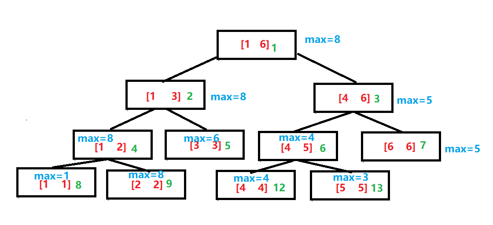

# 线段树

线段树，必须符合区间加法；不需要符合区间减法

将[1,n]分解成若干特定的子区间(数量不超过4*n)

用线段树对“编号连续”的一些点，进行修改或者统计操作，修改和统计的复杂度都是O(log2(n))

用线段树统计的东西，必须符合区间加法，（也就是说，如果已知左右两子树的全部信息，比如要能够推出父节点）；否则，不可能通过分成的子区间来得到[L,R]的统计结果。

一个问题，只要能化成对一些“连续点”的修改和统计问题，基本就可以用线段树来解决了

区间求和，求最大，求最小




参考链接：https://www.cnblogs.com/jason2003/p/9676729.html
https://www.cnblogs.com/iris001999/articles/9058603.html
https://www.cnblogs.com/xenny/p/9801703.html
https://www.cnblogs.com/AC-King/p/7789013.html


```python
# 备注：树的节点从1开始计数
# arr也是从1开始计数
class Node():
    def __init__(self):
        # 左右区间和区间和
        self.l = None
        self.r = None
        self.sum = None
        self.num = 0
        self.lz = 0
class solution():
    def __init__(self, arr):
        self.arr = arr
        self.tree = [Node() for _ in range(4*len(self.arr))]
        self.build(1,1,n)
  
    def push_up(self, i):
        # 节点更新
        self.tree[i].sum = self.tree[2*i].sum+self.tree[2*i+1].sum
    def build(self, i, l, r):
        # 建树
        # 节点i对应的区间l，r
        self.tree[i].l = l
        self.tree[i].r = r
        if l==r:
            self.tree[i].sum=self.arr[l]
            return
        mid = (l+r)//2
        self.build(2*i, l, mid)
        self.build(2*i+1, mid+1, r)
        self.push_up(i)
    # 第一种：对于单点修改，区间查询，不需要push_down
    def search(self, i, l, r):
        # 区间查询(单点修改)
        if l<=self.tree[i].l and self.tree[i].r<=r:
            return self.tree[i].sum
        if self.tree[i].r<l or r<self.tree[i].l:
            return 0
        s = 0
        if l<=self.tree[2*i].r:
            s = s+self.search(2*i, l, r)
        if self.tree[2*i+1].l<=r:
            s = s+self.search(2*i+1, l, r)
        return s
    def add(self, i, dis, k):
        # 单点修改， self.arr[dis]+=k
        if self.tree[i].l==self.tree[i].r:
            self.tree[i].sum+=k
            return
        if dis<=self.tree[2*i].r:
            self.add(2*i, dis, k)
        else:
            self.add(2*i+1, dis, k)
        self.push_up(i)
  
    # 第二种：区间修改（贴标记），单点查询（标记累加）
    def add2(self, i, l, r, k):
        # 第i个节点，区间修改，self.arr[l, r]+=k
        if l<=self.tree[i].l and self.tree[i].r<=r :
            self.tree[i].num+=k
            return 
        if l<=self.tree[2*i].r:
            add(2*i, l, r, k)
        if self.tree[2*i+1].l<=r:
            add(2*i+1, l, r, k)
    def search(self, i, dis):
        ans += self.tree[i].num
    if self.tree[i].l==self.tree[i].r:
        return  
    if dis<=self.tree[2*i].r:
        self.search2(2*i, dis)
    else:
        self.search2(2*i+1, dis)

    # 第三种：对于区间修改（push_down），区间查询(push_down)
    def add3(self, i, l, r, k):
        # 第i个节点，区间修改, self.arr[l, r]+=k
        if l<=self.tree[i].l and self.tree[i].r<=r:
            self.tree[i].sum+=k*(self.tree[i].r-self.tree[i].l+1)
            self.tree[i].lz+=k # 表示本区间的Sum正确，子区间的Sum仍需要根据lz的值来调整  
            return
        self.push_down(i)
        # 此时i的区间和lr肯定有交集，可以假设子区间的l或者r无穷
        if self.tree[2*i].r>=l:
            self.add3(2*i, l, r, k)
        if self.tree[2*i+1].l<=r:
            self.add3(2*i+1, l, r, k)
        self.push_up(i)
        return
  
    def push_down(self, i):
        # 下推标记
        if self.tree[i].lz==0:
            return
        self.tree[2*i].lz+=self.tree[i].lz
        self.tree[2*i].sum+=(self.tree[2*i].r-self.tree[2*i].l)*self.tree[i].lz

        self.tree[2*i+1].lz+=self.tree[i].lz
        self.tree[2*i+1].sum+=(self.tree[2*i+1].r-self.tree[2*i+1].l)*self.tree[i].lz

        self.tree[i].lz=0
  
    def search3(self, i, l, r):
        # 区间查询(区间修改)
        if l<=self.tree[i].l and self.tree[i].r<=r:
            return self.tree[i].sum
        self.push_down(i) #  需要下推标记
        res = 0
        if l<=self.tree[2*i].r:
            res+=self.search3(2*i, l, r)
        if self.tree[2*i+1].l<=r:
            res+=self.search3(2*i+1, l, r)
        return res
```
